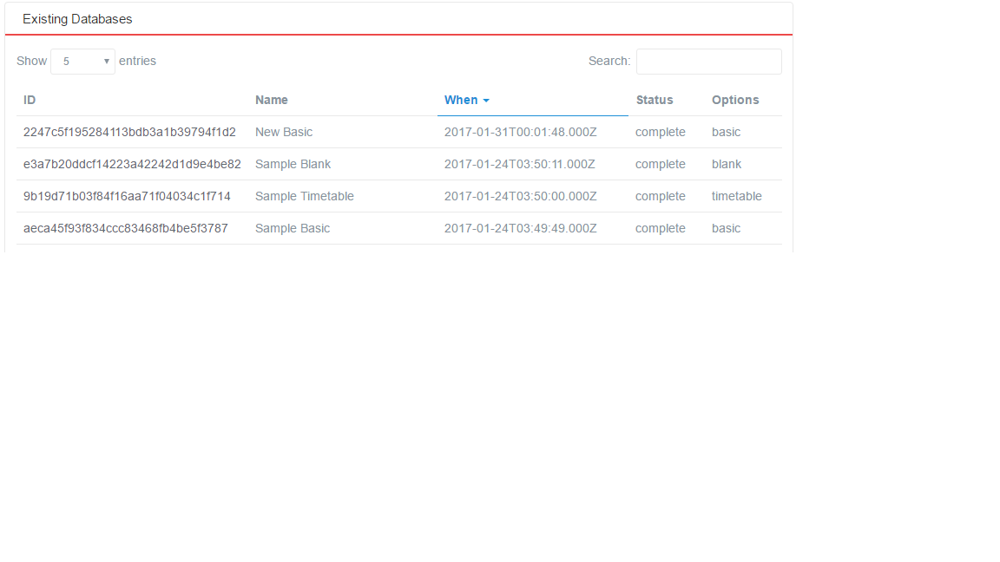
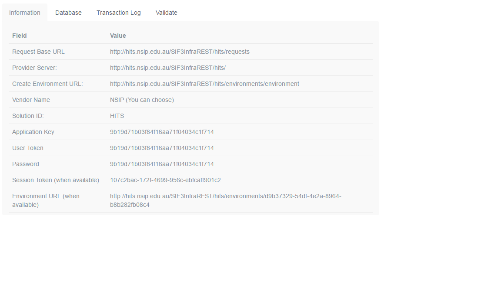

### HITS environment

To be able to connect your consumer to HITS you must have an account on
HITS. Please contact NSIP to provide you with details on how to create
one. Once you have an account, please login or use your account URL that
is of the form <http://hits.nsip.edu.au/dashboard/account.html> to get
to the landing page. In the menu on the right select “Developer
Tools-&gt;Databases” to get your available sandbox databases.

Either you create a new database or you use one that has been created
previously. In the lower part of that page you will see something like
this:

###### Figure 1: SIF3 HITS Database View

Select one of the existing databases and you will get the details page
of that database with the SIF Environment information. The second part
of that page looks like this:

###### Figure 2: SIF3 HITS Environment Page

### Configure REST Client 

To configure your REST client to connect to the HITS environment listed
in previous section, you need to do the following steps. Refer to
https://www.sifassociation.org/Specification/Documents/InfrastructureServices.pdf
for more information.

### Step 1
Create an environment request payload. If the Environment
URL and Session Token are already available from the dashboard, steps
1–3 can be skipped.

The payload will populate the following XML template:

<environment xmlns="http://www.sifassociation.org/infrastructure/3.1">
  <solutionId>HITS</solutionId>
  <authenticationMethod>Basic</authenticationMethod>
  <instanceId/>
  <userToken/>
  <consumerName></consumerName>
  <applicationInfo>
    <applicationKey></applicationKey>
    <supportedInfrastructureVersion>3.1</supportedInfrastructureVersion>
  <dataModelNamespace>http://www.sifassociation.org/au/datamodel/3.4</dataModelNamespace>
    <transport>REST</transport>
    <applicationProduct>
      <vendorName>Systemic Pty Ltd</vendorName>
      <productName>Test Driver</productName>
      <productVersion>0.1alpha</productVersion>
    </applicationProduct>
  </applicationInfo>
</environment>

-   Put the value of the “SIF solutionId” as seen from Figure 2 into the
    &lt;solutionId&gt; node.

-   Put the value of the “User Token” as seen from Figure 2 into the
    &lt;userToken&gt; node.

-   Put the value of the “Application Key” as seen from Figure 2 into
    the &lt;applicationKey&gt; node.

-   You can change the values under the &lt;applicationProduct&gt; node
    to any value that is applicable to you. Leave everything else as is.

**Step 2**: Create the authentication token for the initial environment
request. Under HTTP Basic Authentication, this is done as follows.

-   Create the consumer token: this is the Value of “Application Key”
    from Figure 2, followed by colon, followed by the Value of
    “Password” from Figure 2. For this example, it would be
    9b19d71b03f84f16aa71f04034c1f1714:9b19d71b03f84f16aa71f04034c1f1714

-   Base-64 encode the consumer token

-   Prefix the Base 64 encoding of the consumer token with “BASIC ”

HITS will soon be implementing HMAC SHA-256 authentication as an
alternative. The procedure under HMAC SHA-256 to generate an
authorisation token is as follows:

-   create a timestamp in ISO-8601 format eg. 2017-02-27T09:48:42.942Z

-   take the string ApplicationKey:timestamp and hash it using
    HMACSHA256 with the Password as the key, then base64 encode
    this hash. ApplicationKey and Password are from the Dashboard from
    Figure 2; timestamp is taken from the previous step.

-   Base64 encode the string ApplicationKey:Base64EncodedHash, where
    applicationKey is from the dashboard, and Base64EncodedHash is taken
    from the previous step.

-   Prefix the result of the previous step with “SIF\_HMACSHA256 ”.

**Step 3**: Post the environment body payload, authenticated with the
authorisation token, to the URL named in *Create Environment URL* from
Figure 2.

-   Under BASIC HTTP authentication, the resulting token is included in
    the HTTP header of the POST to the URL, as the Authorization:
    field contents.

-   Under HMAC SHA-256 authentication, the resulting token is included
    in the HTTP header of the POST to the URL, as the Authorization:
    field contents, and the timestamp value derived above is included in
    the HTTP header, as the timestamp: field contents.

**Step 4**: Your client should be authorised now to interact with a new
defined environment. The HITS dashboard, under Figure 2, will now
display a “Session Token” and “Environment URL” value.

**Step 5**:

-   Read the Request Base URL from Figure 2. That is the base of the URL
    to which you will be addressing your REST queries.

-   Suffix to the Request Base URL the name of the object you wish to
    access, followed by “s”; e.g.
    <http://hits.nsip.edu.au/SIF3InfraREST/hits/requests/SchoolInfos/>

**Step 6**: Create an authorisation token for the REST query.

Under BASIC HTTP authentication, the same token will be used for all
interactions with the server.

-   Read the Session Token from Figure 2. This is used for the basis of
    the authorization value to be included with all subsequent
    interactions with the Environment URL.

-   Read the Password from Figure 2. This is used for the basis of the
    authorization value to be included with all subsequent interactions
    with the Environment URL.

-   Concatenate the Application Key and the Session Token, separating
    them by colon.

<!-- -->

-   Base-64 encode the resulting token

-   Prefix the Base 64 encoding of the consumer token with “BASIC ”.
    This is the authorisation token.

Under HMAC SHA-256 authentication, each authorisation token is
timestamped, so there is a different token for each post.

-   create a timestamp in ISO8601 format e.g. 2017-02-27T09:48:42.942Z

-   take the string SessionToken:timestamp, and hash it using HMACSHA256
    with the Password as the key, then base64 encode this hash.
    ApplicationKey and Password are from the Dashboard from Figure 2;
    timestamp is taken from the previous step

-   Base64 encode the string SessionToken:Base64EncodedHash,
    where SessionToken is from the dashboard and Base64EncodedHash is
    from the previous step.

-   Prefix the Base 64 encoding of the consumer token with
    “SIF\_HMACSHA256 ”. This is the authorisation token.

**Step 7**:

Use the authorization field to authenticate all SIF REST queries,
addressing them to the Environment URL suffixed with the plural object
name.

Under BASIC HTTP authentication

-   The authorisation token is included in the HTTP header for all
    subsequent queries, as the Authorization: field contents

-   authenticationMethod with the value BASIC

-   Alternatively, the request parameter access\_token can be included
    in the request, with the authorisation token as its value (without
    the BASIC prefix)

Under HMAC SHA-256 authentication

-   The authorisation token is included in the HTTP header for all
    subsequent queries, as the Authorization: field contents

-   Send a header "timestamp" with the value of timestamp from above.

-   instead of headers you can also send your requests with the
    following request parameters :

    -   timestamp with the value of timestamp above

    -   authenticationMethod with the value SIF\_HMACSHA256

    -   access\_token with the last base64 value from above (without the
        SIF\_HMACSHA256 prefix)

#####
